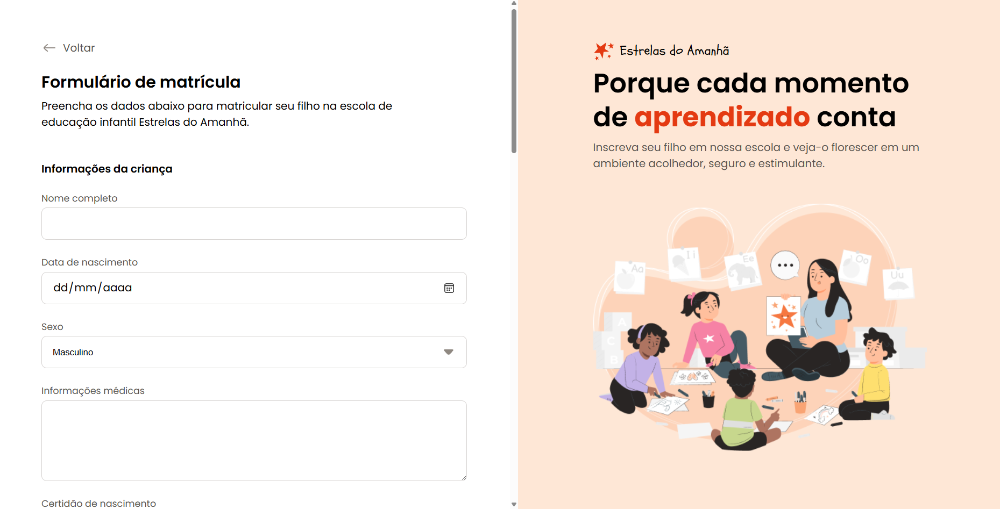

# Estrelas do Amanhã

 
## 📖 Descrição
Projeto desenvolvido para praticar e aprimorar habilidades no uso de inputs de diversos tipos e suas personalizações. O design foi criado pela Rocketseat no Figma.

## 🚀 Tecnologias Utilizadas
- ✅ HTML 
- ✅ CSS

## ⚡ Como Rodar o Projeto
Clone este repositório.
Acesse o diretório do projeto.
Abra o arquivo *index.html* no navegador ou utilize o plugin **Live Server** no VS Code.
## 🔧 Futuras Melhorias
- Adicionar requisitos aos inputs. 
- Tornar o projeto mais responsivo.